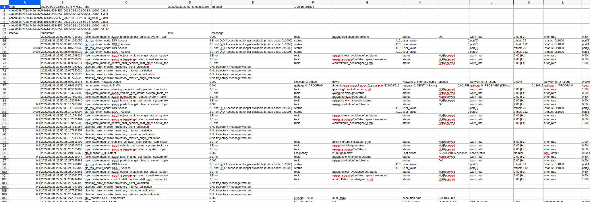
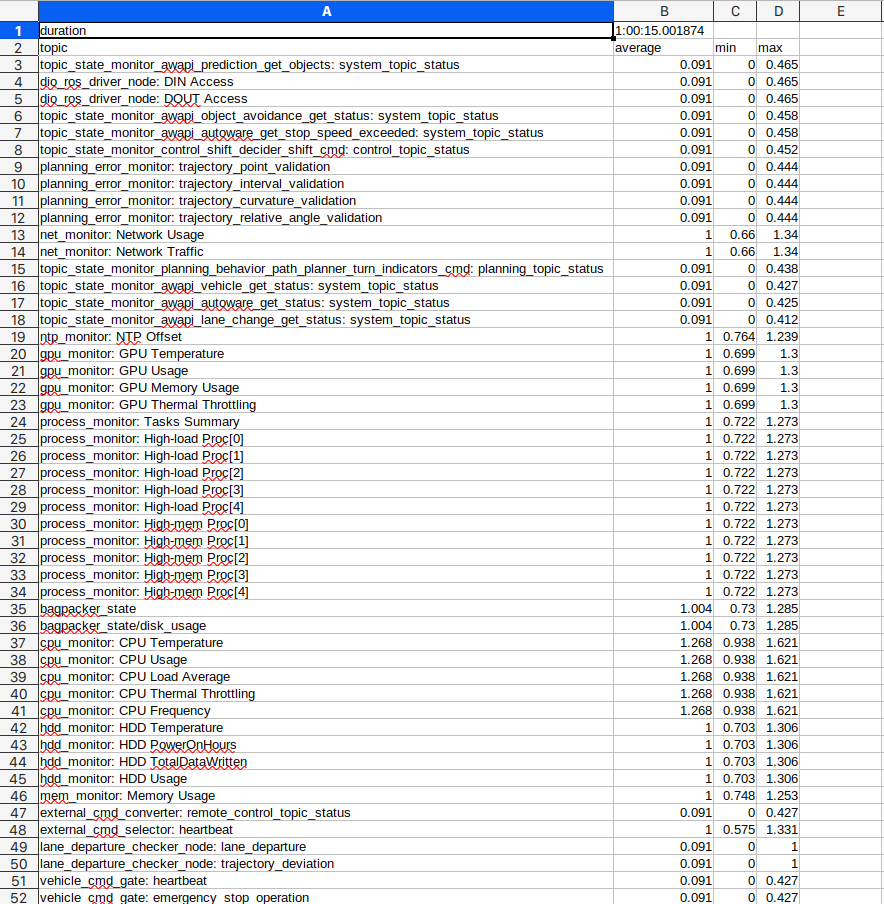

# rosbag2_csv

Convert rosbag2 to csv file.
Add all of ROS2 executables and libraries to your path and library path before using this tool like;

```console
source install/setup.bash
```

## Usage

```console
python3 rosbag2_diag.py <rosbag file location>
```

## This tool generates

- CSV with extracted `/diagnostics` and `/system/emergency/hazard_status` from rosbag(s).

  

- CSV with extracted interval statistics of `/diagnostics` from rosbag(s).

  

## You can filter `/diagnostics` data by diagnostic name

ex.)

```console
python3 rosbag2_diag.py <rosbag file location> cpu
```
